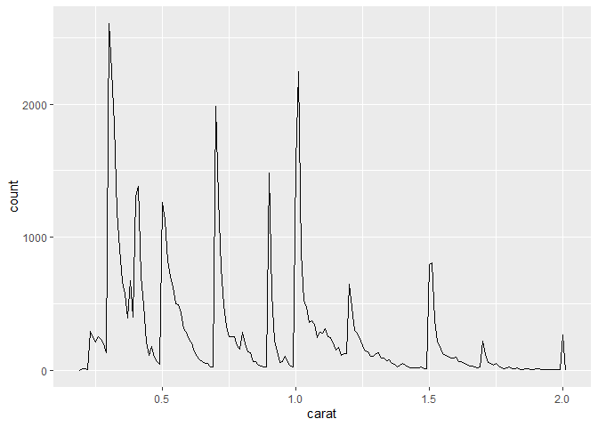

Diamond sizes
================
Xu Han
2023

We have data about 53940 diamonds. Only 1889 are larger than 2 carats.
The distribution of the remainder is shown below:

## This next code chunk will make a plot in our output doc

<!-- -->
