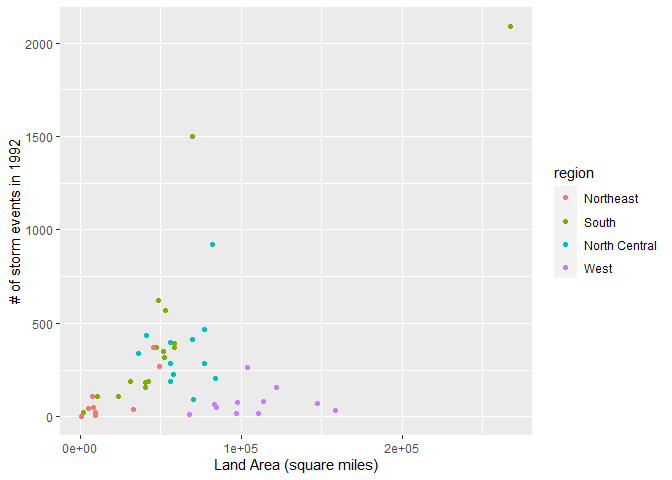

Assignment4
================
Xu Han
2023-10-08

``` r
packages = c("tidyverse","knitr","bslib","finalfit","misty","ggplot2")
#check for missing packages; load and install as needed.
package.check <- lapply(packages, FUN = function(x){
    if (!require(x, character.only = TRUE)) {
        install.packages(x, dependencies = TRUE)
        library(x, character.only = TRUE)
    }
})
```

    ## Loading required package: tidyverse

    ## Warning: package 'tidyverse' was built under R version 4.1.3

    ## Warning: package 'ggplot2' was built under R version 4.1.3

    ## Warning: package 'tibble' was built under R version 4.1.3

    ## Warning: package 'tidyr' was built under R version 4.1.3

    ## Warning: package 'readr' was built under R version 4.1.3

    ## Warning: package 'purrr' was built under R version 4.1.3

    ## Warning: package 'dplyr' was built under R version 4.1.3

    ## Warning: package 'stringr' was built under R version 4.1.3

    ## Warning: package 'forcats' was built under R version 4.1.3

    ## Warning: package 'lubridate' was built under R version 4.1.3

    ## -- Attaching core tidyverse packages ------------------------ tidyverse 2.0.0 --
    ## v dplyr     1.1.2     v readr     2.1.4
    ## v forcats   1.0.0     v stringr   1.5.0
    ## v ggplot2   3.4.2     v tibble    3.2.1
    ## v lubridate 1.9.2     v tidyr     1.3.0
    ## v purrr     1.0.1

    ## -- Conflicts ------------------------------------------ tidyverse_conflicts() --
    ## x dplyr::filter() masks stats::filter()
    ## x dplyr::lag()    masks stats::lag()
    ## i Use the conflicted package (<http://conflicted.r-lib.org/>) to force all conflicts to become errors
    ## Loading required package: knitr
    ## 
    ## Loading required package: bslib
    ## 
    ## 
    ## Attaching package: 'bslib'
    ## 
    ## 
    ## The following object is masked from 'package:utils':
    ## 
    ##     page
    ## 
    ## 
    ## Loading required package: finalfit

    ## Warning: package 'finalfit' was built under R version 4.1.3

    ## Loading required package: misty
    ## |-------------------------------------|
    ## | misty 0.5.3 (2023-09-17)            |
    ## | Miscellaneous Functions T. Yanagida |
    ## |-------------------------------------|

## 1 Import and save the dataset

``` r
storm=read.csv("C:/Users/xuhans/data_analytic_program/Data_preparation/week 6/storm_events.csv")
```

## 2 limit the dataframe to

• the beginning and ending dates and times • BEGIN_YEARMONTH • the
episode ID • the event ID • the state name and FIPS • the “CZ” name •
type • CZ_FIPS • the event type • the source • the beginning latitude
and longitude and ending latitude and longitude

``` r
strom2=storm%>%
      select(BEGIN_YEARMONTH,BEGIN_DAY,BEGIN_TIME,END_YEARMONTH,END_DAY,END_TIME,EPISODE_ID,EVENT_ID,STATE,STATE_FIPS,CZ_NAME,CZ_TYPE,CZ_FIPS,EVENT_TYPE,SOURCE,BEGIN_LAT,BEGIN_LON,END_LAT,END_LON)
```

## 3 Arrange the data by beginning year and month

``` r
storm3=strom2%>%
  arrange(BEGIN_YEARMONTH)

storm3%>%
  head(10)
```

    ##    BEGIN_YEARMONTH BEGIN_DAY BEGIN_TIME END_YEARMONTH END_DAY END_TIME
    ## 1           199201        14       1030        199201      14     1030
    ## 2           199201        14       1031        199201      14     1031
    ## 3           199201        14       1034        199201      14     1034
    ## 4           199201        14       1130        199201      14     1130
    ## 5           199201        14       1130        199201      14     1130
    ## 6           199201        14        950        199201      14      950
    ## 7           199201        14       1000        199201      14     1000
    ## 8           199201        14       1000        199201      14     1000
    ## 9           199201        14       1000        199201      14     1000
    ## 10          199201        14       1000        199201      14     1000
    ##    EPISODE_ID EVENT_ID        STATE STATE_FIPS      CZ_NAME CZ_TYPE CZ_FIPS
    ## 1          NA 10115132 PENNSYLVANIA         42  SUSQUEHANNA       C     115
    ## 2          NA 10115133 PENNSYLVANIA         42 PHILADELPHIA       C     101
    ## 3          NA 10115134 PENNSYLVANIA         42   MONTGOMERY       C      91
    ## 4          NA 10079696   NEW JERSEY         34        UNION       C      39
    ## 5          NA 10079697   NEW JERSEY         34    MIDDLESEX       C      23
    ## 6          NA 10114276 PENNSYLVANIA         42   LACKAWANNA       C      69
    ## 7          NA 10114277 PENNSYLVANIA         42      LUZERNE       C      79
    ## 8          NA 10114278 PENNSYLVANIA         42   MONTGOMERY       C      91
    ## 9          NA 10114279 PENNSYLVANIA         42   SCHUYLKILL       C     107
    ## 10         NA 10114280 PENNSYLVANIA         42      LUZERNE       C      79
    ##           EVENT_TYPE SOURCE BEGIN_LAT BEGIN_LON END_LAT END_LON
    ## 1  Thunderstorm Wind     NA     41.78    -75.70      NA      NA
    ## 2  Thunderstorm Wind     NA     39.97    -75.17      NA      NA
    ## 3  Thunderstorm Wind     NA     40.28    -75.38      NA      NA
    ## 4  Thunderstorm Wind     NA     40.63    -74.27      NA      NA
    ## 5  Thunderstorm Wind     NA     40.58    -74.30      NA      NA
    ## 6  Thunderstorm Wind     NA     41.58    -75.50      NA      NA
    ## 7  Thunderstorm Wind     NA     40.97    -75.97      NA      NA
    ## 8  Thunderstorm Wind     NA     40.25    -75.63      NA      NA
    ## 9  Thunderstorm Wind     NA     40.82    -75.88      NA      NA
    ## 10 Thunderstorm Wind     NA     41.38    -76.03      NA      NA

## 4 Change state and county name to title case

``` r
storm3$STATE=str_to_title(storm3$STATE)
storm3$CZ_NAME=str_to_title(storm3$CZ_NAME)

storm3[,c("STATE","CZ_NAME")]%>%
  head(5)
```

    ##          STATE      CZ_NAME
    ## 1 Pennsylvania  Susquehanna
    ## 2 Pennsylvania Philadelphia
    ## 3 Pennsylvania   Montgomery
    ## 4   New Jersey        Union
    ## 5   New Jersey    Middlesex

## 5 Limit to the events listed by county FIPS (CZ_TYPE of “C”) and then remove the CZ_TYPE column

``` r
table(storm3$CZ_TYPE)
```

    ## 
    ##     C 
    ## 13534

``` r
storm4=storm3%>%
      filter(CZ_TYPE=="C")%>%
      select(-CZ_TYPE)
```

## 6 Pad the state and county FIPS with a “0” at the beginning (hint: there’s a function in stringr to do this) and then unite the two columns to make one fips column with the 5 or 6-digit county FIPS code (5 points)

``` r
storm4$STATE_FIPS=str_pad(storm4$STATE_FIPS,width=3,side="left",pad="0")
storm4$CZ_FIPS=str_pad(storm4$CZ_FIPS,width=4,side="left",pad="0")
storm4 <- unite(storm4,COUNTY_FIPs, STATE_FIPS,CZ_FIPS, sep = "")

storm4%>%
  head(5)
```

    ##   BEGIN_YEARMONTH BEGIN_DAY BEGIN_TIME END_YEARMONTH END_DAY END_TIME
    ## 1          199201        14       1030        199201      14     1030
    ## 2          199201        14       1031        199201      14     1031
    ## 3          199201        14       1034        199201      14     1034
    ## 4          199201        14       1130        199201      14     1130
    ## 5          199201        14       1130        199201      14     1130
    ##   EPISODE_ID EVENT_ID        STATE COUNTY_FIPs      CZ_NAME        EVENT_TYPE
    ## 1         NA 10115132 Pennsylvania     0420115  Susquehanna Thunderstorm Wind
    ## 2         NA 10115133 Pennsylvania     0420101 Philadelphia Thunderstorm Wind
    ## 3         NA 10115134 Pennsylvania     0420091   Montgomery Thunderstorm Wind
    ## 4         NA 10079696   New Jersey     0340039        Union Thunderstorm Wind
    ## 5         NA 10079697   New Jersey     0340023    Middlesex Thunderstorm Wind
    ##   SOURCE BEGIN_LAT BEGIN_LON END_LAT END_LON
    ## 1     NA     41.78    -75.70      NA      NA
    ## 2     NA     39.97    -75.17      NA      NA
    ## 3     NA     40.28    -75.38      NA      NA
    ## 4     NA     40.63    -74.27      NA      NA
    ## 5     NA     40.58    -74.30      NA      NA

## 7 Change all the column names to lower case

``` r
storm5=storm4%>%
       rename_all(tolower)
storm5%>%
  head(5)
```

    ##   begin_yearmonth begin_day begin_time end_yearmonth end_day end_time
    ## 1          199201        14       1030        199201      14     1030
    ## 2          199201        14       1031        199201      14     1031
    ## 3          199201        14       1034        199201      14     1034
    ## 4          199201        14       1130        199201      14     1130
    ## 5          199201        14       1130        199201      14     1130
    ##   episode_id event_id        state county_fips      cz_name        event_type
    ## 1         NA 10115132 Pennsylvania     0420115  Susquehanna Thunderstorm Wind
    ## 2         NA 10115133 Pennsylvania     0420101 Philadelphia Thunderstorm Wind
    ## 3         NA 10115134 Pennsylvania     0420091   Montgomery Thunderstorm Wind
    ## 4         NA 10079696   New Jersey     0340039        Union Thunderstorm Wind
    ## 5         NA 10079697   New Jersey     0340023    Middlesex Thunderstorm Wind
    ##   source begin_lat begin_lon end_lat end_lon
    ## 1     NA     41.78    -75.70      NA      NA
    ## 2     NA     39.97    -75.17      NA      NA
    ## 3     NA     40.28    -75.38      NA      NA
    ## 4     NA     40.63    -74.27      NA      NA
    ## 5     NA     40.58    -74.30      NA      NA

## 8 Use base dataframe of State to create a dataframe

``` r
us_state_info<-data.frame(state=state.name, area=state.area,region=state.region)
us_state_info%>%
  filter(state=="Maryland")
```

    ##      state  area region
    ## 1 Maryland 10577  South

## 9 Create a dataframe with the number of events per state in the year of your birth. Merge in the state information dataframe you just created in step 8. Remove any states that are not in the state information dataframe

``` r
event_count=storm5%>%
  group_by(state)%>%
  count()

merge_dataset=merge(x=us_state_info,y=event_count,by.x="state",by.y="state")
```

## 10 Create the following plot (10 points)

### The one state in the far north eastern region of the plot is Texas

``` r
merge_dataset%>%
  ggplot(aes(x=area,y=n))+
  geom_point(aes(color=region))+
  labs(x="Land Area (square miles)",
       y="# of storm events in 1992")
```

<!-- -->
